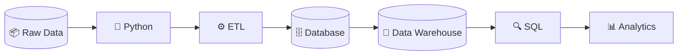
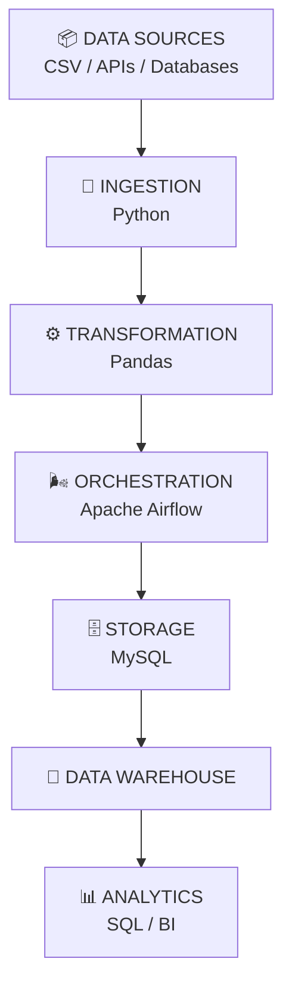
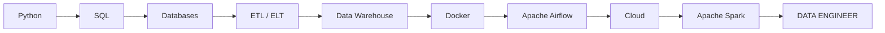

<div align="center">

# ⌁ GUSTAVO LOPES ⌁

### DATA ENGINEERING • DATABASES • DATA SYSTEMS


<br>

[](https://www.linkedin.com/in/iamgustavoti)
[](mailto:gustavolopesti@outlook.com)
[](https://github.com/SEU_USUARIO)

<br>

```text
SYSTEM STATUS
──────────────────────────────────────────
USER.............. Gustavo Lopes
ROLE.............. Future Data Engineer
LOCATION.......... Arapiraca - AL, Brasil
EDUCATION......... Sistemas de Informação
FOCUS............. Data Engineering
STATUS............ BUILDING THE FUTURE...
──────────────────────────────────────────
```

</div>

---

# 🧬 `WHO_AM_I`

```python
class GustavoLopes:

    def __init__(self):
        self.role = "Future Data Engineer"
        self.degree = "Information Systems"
        self.location = "Arapiraca - AL, Brazil"

        self.languages = [
            "Python",
            "SQL"
        ]

        self.databases = [
            "MySQL",
            "SQLite",
            "Oracle"
        ]

        self.data_engineering = [
            "ETL",
            "Data Warehouse",
            "Data Modeling",
            "Apache Airflow",
            "Docker"
        ]

    def mission(self):
        return """
        Transform raw data into
        reliable, structured and
        scalable information.
        """


gustavo = GustavoLopes()

print(gustavo.mission())
```

```text
OUTPUT:

Transform raw data into
reliable, structured and
scalable information.
```

---

# ⚡ `DATA CORE`

<div align="center">


</div>

```text
                 ╭─────────────────╮
                 │    RAW DATA     │
                 │  010101101001   │
                 ╰────────┬────────╯
                          │
                          ▼
                ┌──────────────────┐
                │      PYTHON      │
                │      PANDAS      │
                └────────┬─────────┘
                         │
                    TRANSFORM
                         │
                         ▼
          ┌────────────────────────────┐
          │        DATA PIPELINE       │
          │                            │
          │   EXTRACT → TRANSFORM      │
          │              ↓             │
          │             LOAD           │
          └─────────────┬──────────────┘
                        │
                        ▼
               ╔════════════════╗
               ║   DATABASE     ║
               ║                ║
               ║  ▣ ▣ ▣ ▣ ▣   ║
               ║  ▣ ▣ ▣ ▣ ▣   ║
               ╚═══════╤════════╝
                       │
                       ▼
               DATA WAREHOUSE
                       │
             ┌─────────┴─────────┐
             ▼                   ▼
            SQL              ANALYTICS
             │                   │
             └────────┬──────────┘
                      ▼
                 INTELLIGENCE
```

---

# 🔄 `DATA PIPELINE`



---

# 🧠 `CURRENT_FOCUS`

```sql
SELECT
    skill,
    status
FROM
    engineering_stack
WHERE
    developer = 'Gustavo Lopes';
```

```text
+------------------------+----------------------+
| SKILL                  | STATUS               |
+------------------------+----------------------+
| Python                 | █████████░ Learning  |
| SQL                    | █████████░ Building  |
| MySQL                  | █████████░ Building  |
| Data Warehouse         | ████████░░ Learning  |
| ETL / ELT              | ████████░░ Learning  |
| Apache Airflow         | ███████░░░ Learning  |
| Docker                 | ███████░░░ Learning  |
| Data Engineering       | ████████░░ Evolving  |
+------------------------+----------------------+
```

---

# 🛠️ `TECH STACK`

<div align="center">

### DATABASES


<br><br>

### LANGUAGES


<br><br>

### DATA & ENGINEERING


<br><br>

### INFRASTRUCTURE & TOOLS


</div>

---

# 🛰️ `DATA ENGINEERING ARCHITECTURE`



---

# 💾 `DATABASE_MODEL`

```text
                  DATA WAREHOUSE
                        │
        ┌───────────────┼────────────────┐
        │               │                │
        ▼               ▼                ▼
  dim_cliente      dim_produto      dim_loja
        │               │                │
        └───────────────┼────────────────┘
                        │
                        ▼
                  fato_vendas
                        │
                        ▼
                    dim_data
```

---

# 🚀 `FEATURED_PROJECTS`

## 📊 Data Pipeline Vendas

```text
CSV
 ↓
Python
 ↓
Pandas
 ↓
ETL
 ↓
MySQL
 ↓
Data Warehouse
 ↓
SQL
 ↓
Apache Airflow
 ↓
Docker
```

Projeto desenvolvido para praticar uma arquitetura de **Engenharia de Dados**, desde a ingestão até armazenamento e análise.

`Python` `Pandas` `SQL` `MySQL` `Airflow` `Docker` `ETL`

---

## ☕ Coffee Shop Database

Sistema relacional para gerenciamento de uma cafeteria.

```text
SQLite
   +
SQL
   +
Views
   +
Triggers
   +
Python
```

Aplicação de modelagem relacional, consultas avançadas e automação dentro do banco de dados.

---

## 🎮 CrashGAME

Jogo desenvolvido em Python utilizando Pygame.

```text
Python → Events → Movement → Collision → Score → Game
```

Projeto criado para praticar fundamentos de programação e desenvolvimento de aplicações.

---

## 🛒 E-commerce

Aplicação web de comércio eletrônico com:

```text
Frontend
   +
Backend
   +
Database
   ↓
E-COMMERCE
```

Tecnologias:

`HTML` `CSS` `JavaScript` `PHP` `MySQL`

---

# 📡 `DATA STREAM`

<div align="center">


</div>

---

# 📊 `GITHUB_ANALYTICS`

<div align="center">


</div>

---

# 🔥 `ACTIVITY`

<div align="center">


</div>

---

# 🐍 `CONTRIBUTION_PIPELINE`

<div align="center">

<p>
  Dados fluindo pelo histórico de contribuições...
</p>


</div>

---

# 🎯 `MISSION`

```python
while True:

    study("Data Engineering")

    build("Data Pipelines")

    learn("Databases")

    improve("SQL")

    automate("Processes")

    transform(
        raw_data="information"
    )
```

```text
MISSION:

> Construir estruturas de dados confiáveis.

> Criar pipelines escaláveis.

> Automatizar processamento de dados.

> Projetar bancos eficientes.

> Transformar dados em informação.

> Evoluir todos os dias.
```

---

# 🛰️ `ROADMAP`



---

# 📡 `CONNECT`

<div align="center">

### Interested in Data, Engineering or Databases?

Sempre aberto para trocar conhecimento, discutir projetos e aprender com outros profissionais da área.

<br>

[](https://www.linkedin.com/in/iamgustavoti)

[](mailto:gustavolopesti@outlook.com)

<br><br>

```text
╔══════════════════════════════════════════════╗
║                                              ║
║              GUSTAVO LOPES                   ║
║                                              ║
║          FUTURE DATA ENGINEER                ║
║                                              ║
║      PYTHON • SQL • DATABASES • DATA         ║
║                                              ║
╚══════════════════════════════════════════════╝
```


</div>
