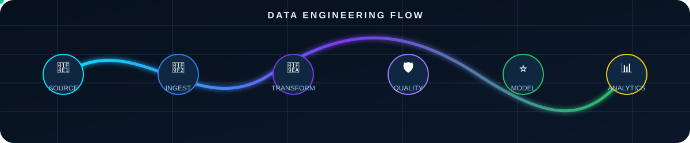
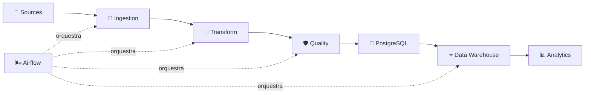

<div align="center">

# 🧬 GUSTAVO LOPES

### DATA ENGINEER • PYTHON • SQL • PIPELINES • AIRFLOW


<br/>

<a href="https://www.linkedin.com/in/iamgustavoti">
  
</a>
<a href="mailto:gustavolopesti@outlook.com">
  
</a>
<a href="https://github.com/iamgusta">
  
</a>

</div>

---

<div align="center">
  
</div>

---

## 🧠 Sobre mim

```text
╭──────────────────────────────────────────────────────────────╮
│ USER ............ Gustavo Lopes                              │
│ LOCATION ........ Arapiraca - AL, Brasil                    │
│ EDUCATION ....... Sistemas de Informação                    │
│ FOCUS ........... Engenharia de Dados                       │
│ STACK ........... Python • SQL • PostgreSQL • Airflow       │
│ MISSION ......... Dados confiáveis → decisões melhores      │
╰──────────────────────────────────────────────────────────────╯
```

Sou estudante de **Sistemas de Informação** com foco em **Engenharia de Dados** e **Banco de Dados**.

Meu objetivo é construir pipelines, modelos e sistemas capazes de transformar **dados brutos** em informação **confiável, organizada e pronta para análise**.

---

## ⚡ System Status

```text
PYTHON ............ ███████████████████░  BUILDING
SQL ............... ████████████████████  ACTIVE
POSTGRESQL ........ ███████████████████░  ACTIVE
DATA PIPELINES .... ██████████████████░░  BUILDING
AIRFLOW ........... ████████████████░░░░  EVOLVING
POWER BI .......... ███████████████░░░░░  EVOLVING
DOCKER ............ ███████████████░░░░░  EVOLVING
```

---

## 🧰 Tecnologias

<div align="center">


<br/><br/>


</div>

---

## 🚀 Projeto em destaque

### 🛒 Plataforma de Dados de E-commerce

Pipeline completo de Engenharia de Dados com:

```text
📡 API + CSV + JSON
        ↓
🐍 Python / Pandas
        ↓
🛡️ Data Quality
        ↓
🐘 PostgreSQL
        ↓
⭐ Data Warehouse
        ↓
🌬️ Apache Airflow
        ↓
🐳 Docker
        ↓
📊 Power BI
```

**Projeto online:**  
https://iamgusta.github.io/Plataforma-dados-e-commerce/


---

## 🧬 Meu fluxo de Engenharia de Dados


```mermaid
flowchart LR
    A["📡 Sources"] --> B["🧲 Ingestion"]
    B --> C["🧪 Transform"]
    C --> D["🛡️ Quality"]
    D --> E["🐘 PostgreSQL"]
    E --> F["⭐ Data Warehouse"]
    F --> G["📊 Analytics"]

    H["🌬️ Airflow"] -. orquestra .-> B
    H -. orquestra .-> C
    H -. orquestra .-> D
    H -. orquestra .-> F
```

---

## 📚 Atualmente evoluindo em

```text
🧱 Data Warehouse
🔄 ETL / ELT
🌬️ Apache Airflow
🐳 Docker
⚙️ Orquestração de Pipelines
🗃️ Modelagem Dimensional
📊 Business Intelligence
```

---

## 🎯 Visão

> Projetar pipelines e arquiteturas capazes de entregar dados organizados, confiáveis e úteis para pessoas e sistemas.

```text
RAW DATA
   ↓
INGEST
   ↓
TRANSFORM
   ↓
VALIDATE
   ↓
MODEL
   ↓
ANALYZE
   ↓
DECIDE
```

---

<div align="center">

### 📡 OPEN TO DATA • ENGINEERING • DATABASES • TECHNOLOGY

**⌁ Gustavo Lopes ⌁**

`dados → engenharia → inteligência`

</div>
