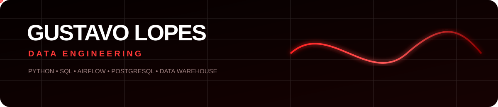

<div align="center">



<br>

<a href="https://iamgusta.github.io/iamgusta/">
  
</a>
<a href="https://www.linkedin.com/in/iamgustavoti">
  
</a>
<a href="mailto:gustavolopesti@outlook.com">
  
</a>

</div>

## `whoami`

Estudante de **Sistemas de Informação** com foco em **Engenharia de Dados**.

Construo projetos que percorrem o caminho completo dos dados: **ingestão → transformação → qualidade → modelagem → orquestração → análise**.

```text
LOCATION  Arapiraca - AL, Brasil
FOCUS     Data Engineering
CORE      Python + SQL
BUILDING  Pipelines + Data Warehouse + Airflow
```

## Projeto em destaque

### Plataforma de Dados de E-commerce

Pipeline de dados de ponta a ponta com **FastAPI, Python, Pandas, PostgreSQL, Data Warehouse, Apache Airflow, Docker e Power BI**.

**[Abrir plataforma](https://iamgusta.github.io/Plataforma-dados-e-commerce/)** · **[Ver repositório](https://github.com/iamgusta/Plataforma-dados-e-commerce)**

```text
API / CSV / JSON
       ↓
Python + Pandas
       ↓
Data Quality
       ↓
PostgreSQL
       ↓
Star Schema
       ↓
Airflow + Docker
       ↓
Power BI
```

## Stack

`Python` · `SQL` · `PostgreSQL` · `MySQL` · `Apache Airflow` · `Docker` · `Power BI` · `Git`

---

<div align="center">

**dados → engenharia → inteligência**

[Portfólio](https://iamgusta.github.io/iamgusta/) • [LinkedIn](https://www.linkedin.com/in/iamgustavoti) • [GitHub](https://github.com/iamgusta)

</div>
